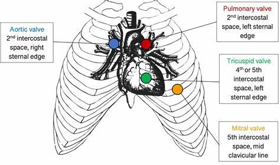
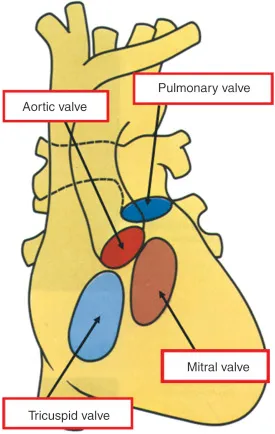
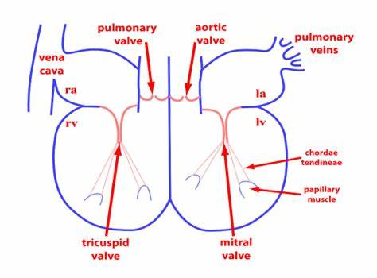

# HeartML
Dataset: [`The CirCor DigiScope Phonocardiogram Dataset`](https://physionet.org/content/circor-heart-sound/1.0.3/)

The file `training_data.csv` contains the overall information for all the records of the training set in the PhysioNet Challenge 2022;
- PV corresponds to the pulmonary valve point;
- TV corresponds to the tricuspid valve point;
- AV corresponds to the aortic valve point;
- MV corresponds to the mitral valve point; 
- Phc for any other auscultation Location.

|  |  |  |
|------------------------|------------------------|------------------------|
| Image 1    | Image 2     | Image 3     |
